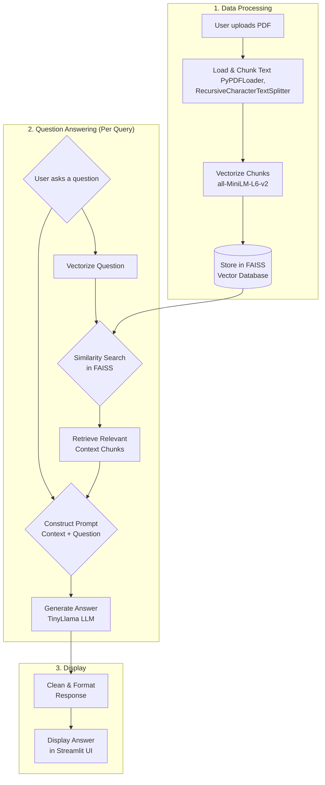

🤖 Multi-Tool AI Assistant

A versatile and interactive web application built with Streamlit and powered by the Google Gemini API. This project provides a suite of AI-powered tools to assist with various language tasks, including text summarization, translation, and professional email drafting.

Live Demo: [Link to your deployed Streamlit app] (https://huggingface.co/spaces/vamsimyla/ragchatbotvm)

✨ Features

📝 Text Summarizer: Paste in long articles or documents and receive a concise, easy-to-read summary.

🌐 Language Translator: Translate text into multiple languages, including Spanish, French, German, Japanese, and more.

✉️ Professional Email Writer: Draft well-structured, professional emails by simply providing a recipient and a few key bullet points.

Interactive UI: A clean and user-friendly interface built with Streamlit, featuring a sidebar for easy tool navigation.

Secure API Key Handling: Utilizes Streamlit's secrets management to securely handle the Google Gemini API key.

📈 Workflow

This diagram illustrates the flow of data and user interaction within the application.

🛠️ Tech Stack

Frontend: Streamlit

AI Model: Google Gemini Pro via the Google Gemini API

Core Libraries: google-generativeai

Language: Python

🚀 Setup and Installation

Follow these steps to run the project locally on your machine.

1. Clone the Repository

git clone [https://github.com/VamsiMyla916/Multi-Tool-AI-Assistant.git](https://github.com/VamsiMyla916/Multi-Tool-AI-Assistant.git)
cd Multi-Tool-AI-Assistant

(Note: You may want to create a new repository for this project named Multi-Tool-AI-Assistant)

2. Create and Activate a Virtual Environment

# Create the environment

python -m venv venv

# Activate on Windows

.\venv\Scripts\activate

# Activate on Mac/Linux

source venv/bin/activate

3. Install Dependencies

All required packages are listed in the requirements.txt file.

pip install -r requirements.txt

4. Set Up Your API Key

You will need a free Google Gemini API key. You can get one from the Google AI Studio.

Create a folder named .streamlit in your project's main directory.

Inside the .streamlit folder, create a new file named secrets.toml.

Add your API key to the secrets.toml file in the following format:

GOOGLE_API_KEY = "Your-Actual-API-Key-Goes-Here"

🏃‍♀️ Usage

Ensure your virtual environment is active.

Run the Streamlit application from your terminal:

streamlit run app.py

Your web browser will open with the application running. Use the sidebar to select a tool and start using the assistant.

📄 License

This project is licensed under the MIT License.
